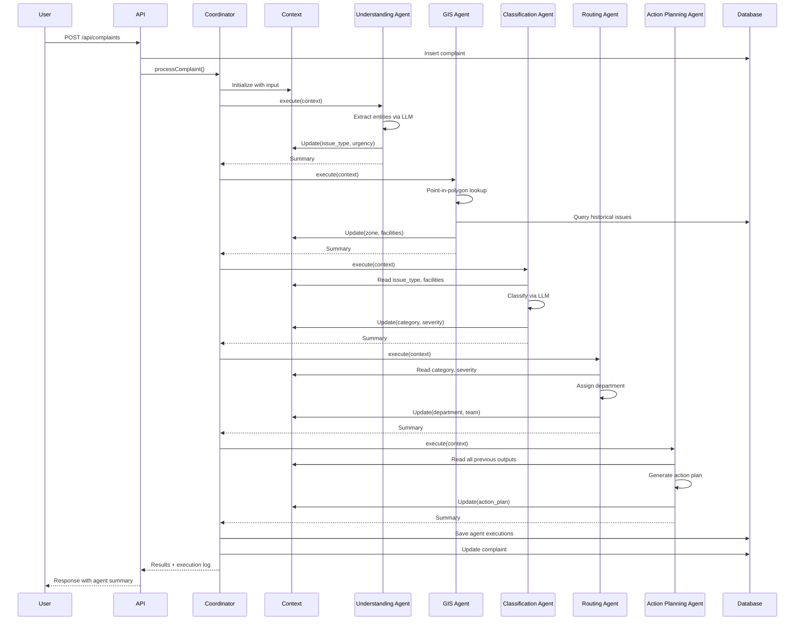

# Multi-Agent System Architecture

## Overview

GeoSmart implements a **true multi-agent AI system** where specialized autonomous agents collaborate to intelligently process civic complaints. This document explains the architectural decisions and how the system demonstrates genuine agentic AI principles.

---

## What Makes This "Agentic"?

### 1. Autonomy
Each agent makes **independent decisions** within its domain of expertise without hardcoded rules dictating outcomes.

**Example:** The Classification Agent doesn't follow simple if-else rules. Instead, it reasons about the complaint considering:
- Context from Understanding Agent (issue type, urgency)
- Context from GIS Agent (nearby facilities, historical patterns)
- Its own understanding of severity criteria

The agent autonomously decides: *"This is HIGH severity because there's a medical facility nearby + prolonged duration + sanitation issue"*

### 2. Shared Memory & Collaboration
All agents read from and write to a **shared context object**, allowing later agents to build upon earlier agents' findings.

**Flow:**
```
Understanding Agent → writes issue_type to context
    ↓
GIS Agent → reads location → writes zone_name, nearby_facilities
    ↓
Classification Agent → reads issue_type + nearby_facilities → determines severity
    ↓
Routing Agent → reads severity + zone_name → assigns department
    ↓
Action Planning Agent → reads all context → creates action plan
```

This is **collaborative intelligence**, not isolated API calls.

### 3. Dynamic Orchestration
The Coordinator Agent intelligently decides which agents to run based on the situation.

**Examples:**
- High severity complaint → Runs all 5 agents
- Low severity complaint → Skips Action Planning Agent
- Category = "Other" → Skips Routing Agent

This demonstrates **emergent behavior** - the system adapts to input complexity.

### 4. Full Traceability
Every agent's contribution is logged with:
- Execution time
- Input received
- Output produced
- Key findings

Users can see **exactly how** the final decision was reached.

---

## System Components

### 1. Coordinator Agent

**Role:** Brain of the system

**Responsibilities:**
- Initialize shared context
- Decide agent execution order
- Handle errors and fallbacks
- Log all executions for traceability

**Decision Logic:**
```javascript
// Dynamic workflow based on context
if (category !== 'Other') {
  await executeAgent('routing');
}

if (severity === 'High' || severity === 'Medium') {
  await executeAgent('actionPlanning');
}
```

### 2. Agent Context (Shared Memory)

**Purpose:** Enable agent collaboration

**Structure:**
```javascript
{
  // Input
  original_text: "complaint text",
  latitude: 17.43,
  longitude: 78.40,
  
  // Understanding Agent outputs
  issue_type: "Garbage accumulation",
  urgency_indicators: ["3 days", "overflowing"],
  
  // GIS Agent outputs
  zone_name: "Khairatabad Zone",
  nearby_facilities: ["Apollo Hospital"],
  
  // Classification Agent outputs
  category: "Sanitation",
  severity: "High",
  
  // Routing Agent outputs
  department: "GHMC Sanitation",
  
  // Action Planning Agent outputs
  action_plan: { ... }
}
```

**Key Feature:** Persistent to database for post-mortem analysis.

### 3. Specialized Agents

#### Understanding Agent
- **Domain:** Natural language processing
- **Input:** Raw complaint text
- **Output:** Structured entities (issue type, urgency, duration)
- **Technology:** Gemini LLM with prompt engineering
- **Fallback:** Keyword-based extraction if LLM unavailable

#### GIS Intelligence Agent
- **Domain:** Geospatial enrichment
- **Input:** Latitude, longitude
- **Output:** Zone/ward, nearby facilities, historical issues
- **Technology:** Turf.js for point-in-polygon, database queries
- **Fallback:** Default zone if lookup fails

#### Classification Agent
- **Domain:** Issue categorization and prioritization
- **Input:** Context from Understanding + GIS agents
- **Output:** Category, severity, impact scope, reasoning
- **Technology:** Gemini LLM with context-aware prompting
- **Fallback:** Rule-based classification

#### Routing Agent
- **Domain:** Department assignment
- **Input:** Category, severity, ward from previous agents
- **Output:** Department, team, escalation flag
- **Technology:** Gemini LLM or rule-based mapping
- **Fallback:** Category → Department mapping table

#### Action Planning Agent
- **Domain:** Resolution planning
- **Input:** All previous agent outputs
- **Output:** Immediate actions, timeline, resources, notes
- **Technology:** Gemini LLM with planning prompts
- **Fallback:** Template-based plans per category

---

## Data Flow



---

## Database Schema

### Key Tables

#### `complaints`
Stores complaint records with AI-processed metadata
- Original data: text, location, timestamp
- AI outputs: category, severity, department, action_plan

#### `agent_executions`
Tracks every agent run for full traceability
- Which agent ran
- Input/output data (JSONB)
- Execution time
- Success/error status

#### `agent_context`
Persists shared context for each complaint
- Complete context snapshot
- Used for debugging and analysis

---

## Extensibility

### Adding a New Agent

1. Create new agent class:
```javascript
class SentimentAgent {
  async execute(context) {
    const text = context.get('original_text');
    
    // Your logic (LLM call, analysis, etc.)
    const sentiment = await analyzeSentiment(text);
    
    // Update shared context
    context.update('SentimentAgent', {
      sentiment: sentiment.label,
      emotion: sentiment.emotion
    });
    
    return { summary: `Sentiment: ${sentiment.label}` };
  }
}
```

2. Register in Coordinator:
```javascript
this.agents = {
  understanding: new UnderstandingAgent(),
  gis: new GISIntelligenceAgent(),
  sentiment: new SentimentAgent(),  // NEW!
  classification: new ClassificationAgent(),
  // ...
};
```

3. Add to workflow:
```javascript
await this.executeAgent('sentiment', context, executionLog);
```

**That's it!** No changes to existing agents needed.

---

## Technology Choices

### Why Gemini API?
- Free tier available
- Fast response times (~500-1000ms per agent)
- Good at structured JSON output
- Easy function calling for agents

### Why Not LangChain/AutoGPT?
We built a **custom orchestration layer** because:
- Full control over agent workflow
- Transparent execution logging
- Simpler to understand and explain
- No framework lock-in

### Why PostgreSQL?
- JSONB for flexible agent data storage
- Strong ACID guarantees
- PostGIS extension available for future GIS features
- Industry standard

### Why Leaflet vs. Google Maps?
- Open source and free
- Lightweight
- Easy marker customization
- Works with OpenStreetMap tiles

---

## Performance Considerations

### Execution Times
- **Understanding Agent:** ~800-1000ms (LLM call)
- **GIS Agent:** ~300-500ms (computation + DB query)
- **Classification Agent:** ~700-1000ms (LLM call)
- **Routing Agent:** ~500-800ms (LLM call or instant with fallback)
- **Action Planning Agent:** ~500-700ms (LLM call)

**Total:** ~3-4 seconds for full pipeline

### Optimization Strategies
1. **Parallel execution** where possible (Understanding + GIS could run in parallel)
2. **Caching** for zone lookups
3. **Batching** LLM calls if processing multiple complaints
4. **Fallback modes** for instant responses when LLM is slow

---

## Future Enhancements

### Potential New Agents
- **Sentiment Analysis Agent:** Detect citizen frustration levels
- **Image Analysis Agent:** Process uploaded complaint images
- **Historical Pattern Agent:** Detect recurring issues in areas
- **Priority Negotiation Agent:** Resolve conflicting priorities

### Advanced Orchestration
- **Parallel agent execution** for independent agents
- **Conditional loops** (re-run classification if confidence is low)
- **Human-in-the-loop** for high-stakes decisions

### Multi-Agent Communication
- Agents could directly "message" each other
- Agents could request clarification from other agents
- Emergent collaboration patterns

---

## Comparison: Single-Agent vs. Multi-Agent

### Single-Agent Approach
```javascript
// One prompt with everything
const prompt = `Analyze this complaint and return category, 
severity, department, action plan...`;
const result = await gemini.generate(prompt);
```

**Problems:**
- ❌ No specialization
- ❌ Can't leverage GIS tools
- ❌ No traceability
- ❌ Can't adapt workflow
- ❌ Difficult to debug

### Our Multi-Agent Approach
```javascript
const coordinator = new CoordinatorAgent();
const result = await coordinator.processComplaint(data);
// → 5 specialized agents collaborate
```

**Benefits:**
- ✅ Each agent is expert in its domain
- ✅ GIS agent uses actual geospatial tools
- ✅ Full execution trace
- ✅ Dynamic workflow (skip agents as needed)
- ✅Clear debugging of each agent

---

## Conclusion

This architecture demonstrates **true agentic AI** through:
1. **Autonomous agents** making independent decisions
2. **Shared context** enabling collaboration
3. **Dynamic orchestration** adapting to complexity
4. **Full explainability** of every decision
5. **Easy extensibility** for new capabilities

This is not just "calling an LLM 5 times" - it's a **coordinated multi-agent system** where specialized intelligence emerges from collaboration.
